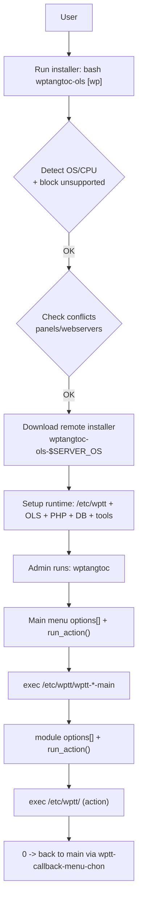

# WPTangToc OLS — Architecture & Flow

## Mục tiêu chương này

- Chốt “**how it works**” ở mức hệ thống: bootstrap → runtime → menu → module → script con.
- Tạo chuẩn để maintain: **sửa đúng lớp** (OLS config / .htaccess / filesystem / system service / cron / cloud backup).

## 1) Kiến trúc 3 lớp

### Lớp A — Bootstrap installer (repo + remote)

- `wptangtoc-ols` (trong repo): kiểm tra OS/panel xung đột → tải installer phù hợp OS từ `wptangtoc.com`.
- Installer “thực thi cài đặt” chủ yếu nằm ở **remote script**: `wptangtoc-ols-$SERVER_OS`.

### Lớp B — Runtime trên VPS (sau khi cài)

Các vị trí runtime quan trọng:

- `/etc/wptt/.wptt.conf`: cấu hình global (ngôn ngữ, website chính, telegram, flags…)
- `/etc/wptt/lang/*.sh`: text menu theo ngôn ngữ (biến chuỗi hiển thị)
- `/etc/wptt/vhost/.*.conf`: state/config theo từng domain (flags per-site)
- `/usr/local/lsws/<domain>/html`: docroot theo domain
- `/usr/local/lsws/conf/httpd_config.conf`: OLS global config (cẩn trọng khi sửa)

### Lớp C — CLI Control Panel (menu)

- Menu chính: `wptangtoc`
- Menu module: `wptt-*-main`
- Menu framework:
  - `wptt-header-menu` (banner + health check)
  - `wptt-callback-menu-chon` (select + optional fzf + back-to-main)

## 2) Sơ đồ flow (tổng thể)

## 3) Pattern menu chuẩn (để AI Agent maintain)

### 3.1 Menu chính `wptangtoc`

**File nguồn (repo template)**: `tool-wptangtoc-ols/wptangtoc`  
**Runtime kỳ vọng**: thường được cài thành `/usr/bin/wptangtoc` (và các module ở `/etc/wptt/*`).

Chuẩn hoạt động (đọc từ code):

- **Encoding/input**: `stty iutf8` để nhập tiếng Việt/domain ổn định.
- **Dependency gate**: `check_dependencies()` auto-install các tool thiếu: `pv`, `wp`, `curl`, `zip`, `unzip`, `wget` (qua `dnf` hoặc `apt-get`). Nếu thiếu `wp` thì tải `wp-cli.phar` và đặt vào `/usr/local/bin/wp`.
- **Load state**:
  - bắt buộc có `/etc/wptt/.wptt.conf` (không có thì exit).
  - `ngon_ngu` default `vi`.
  - load `/etc/wptt/lang/$ngon_ngu.sh` (fallback sang `vi.sh`).
- **Health check + auto heal (khi chạy không có $1)**:
  - check `lswsctrl status` (OLS).
  - check `systemctl status mariadb` (mariadb).
  - nếu fail, có nhánh thử `restart` và in cảnh báo.
- **Menu render**:
  - `options=(...)` là danh sách item hiển thị.
  - `run_action(index)` dùng **0-based index** để map sang script `/etc/wptt/...`.
  - `select opt in "${options[@]}"` nhưng xử lý theo `REPLY`:
    - `0`: thoát khỏi menu (và gọi `. /etc/wptt/wptt-status2` nếu có).
    - `00`: chọn nhanh bằng `fzf` (nếu cài).
    - `1..N`: map thành `action_index = REPLY - 1` → gọi `run_action(action_index)`.
- **Quy ước quan trọng**: `run_action` dùng `exec "$script_path" $script_args` để **thay thế process** (tránh “stack menu”, tiết kiệm RAM).

### 3.2 Menu module `wptt-*-main`

Chuẩn:

- Nếu không có tham số `$1`: gọi `header_menu()`
- Load `.wptt.conf` + lang
- `options=(...)`
- `run_action(index)` map → `exec /etc/wptt/<script-con> [args]`
- Cuối cùng `. /etc/wptt/wptt-callback-menu-chon`

### 3.3 Menu framework (dùng chung cho module): `wptt-callback-menu-chon`

**File nguồn (repo template)**: `tool-wptangtoc-ols/wptt-callback-menu-chon`

- Dùng `select` để render `options[]` và đọc lựa chọn.
- Hỗ trợ `00` để bật `fzf` nếu có.
- Quy ước back-to-main:
  - `0` trong menu module sẽ `exec /usr/bin/wptangtoc 1` (quay lại menu chính).
- Quy ước index:
  - Người dùng nhập `1..N`, framework map về `action_index = REPLY - 1` rồi gọi `run_action(action_index)` (0-based).

## 4) Các lớp tác động (impact layers)

Khi một tính năng “bật/tắt”, hãy xác định nó tác động vào lớp nào:

- **Webserver global config**: OLS config, modules (ví dụ ModSecurity).
- **Per-site web rules**: `.htaccess` (firewall 8G, block bot, hotlinking…).
- **Filesystem hardening**: chmod/chattr/ownership, per-user isolation.
- **Kernel / eBPF**: XDP attach vào NIC, BPF maps pinned ở `/sys/fs/bpf/*` (rủi ro lockout cao, cần rollback rõ).
- **System services**: systemctl restart/start/stop, watchdog, auto-reboot.
- **Cron/automation**: auto backup, auto delete.
- **Cloud integration**: rclone (GDrive/OneDrive), Cloudflare API, Telegram.

## 5) Nơi lưu state (conventions)

Tạm thời (sẽ chuẩn hoá khi đọc toàn bộ code):

- Global flags/settings: `/etc/wptt/.wptt.conf`
- Per-site flags: `/etc/wptt/vhost/.$domain.conf`
- Per-site rules marker: `.htaccess` markers kiểu `#begin-...`/`#end-...`
- Audit log: `/var/log/wptangtoc-ols.log`

## 6) Inventory status sau khi đọc sâu

- [x] Xác định installer remote tạo/copy file thế nào từ `tool-wptangtoc-ols/` → `/etc/wptt/`.
  - **Installer entrypoints (repo)**:
    - `wptangtoc-ols-ubuntu`
    - `wptangtoc-ols-almalinux`, `wptangtoc-ols-almalinux-9`, `wptangtoc-ols-almalinux-10`
  - **Update/refresh installer (repo)**:
    - `ghi-de-update`: download `wptangtoc-ols.zip` → `\cp -rf tool-wptangtoc-ols/* /etc/wptt/` → refresh `/usr/bin/wptangtoc` & `/usr/bin/wptt`
    - `tool-wptangtoc-ols/wptt-cai-lai`: reinstall OLS + download zip + copy `/etc/wptt` + refresh `/usr/bin/*`
- [x] Liệt kê các service/cron job do WPTT OLS tạo ở mức inventory runtime.
  - **Nguyên tắc**: phần lớn cron/service được tạo “theo nhu cầu” khi user bật module (file trong `/etc/cron.d/*`, service trong `/etc/systemd/system/*`).
  - **Đã thấy chắc chắn từ source**:
    - `ddos-blocker-xdp.service` (XDP)
    - cron files: `wptangtoc-ols.cron` (auto update), `reboot-check-service.cron` (service watchdog), `tai-nguyen-check.cron` (resource alert), `auto-restart-mariadb.cron` (DB watchdog), `database-toi-uu-hoa-all.cron` (auto optimize DB), `cai-ssl-auto-<domain>-tu-dong.cron` (auto cài SSL), `wp-cron-job-<domain>.cron` (WP cron), v.v.
  - **Đã chuẩn hoá inventory**:
    - Cron inventory: `docs/09-CRON-INVENTORY.md`
    - Systemd inventory: `docs/10-SYSTEMD-INVENTORY.md`
    - Shell hooks inventory: `docs/11-SHELL-HOOKS-INVENTORY.md`
    - Root helpers inventory: `docs/12-ROOT-HELPERS-INVENTORY.md`
- [x] “Rollback story”: mỗi lớp tác động có quy trình revert ngắn gọn trong `docs/05-RUNBOOKS.md`.

## 7) Rollback story by impact layer

- **Firewall / anti-DDoS**:
  - rollback-first phải ưu tiên giữ được SSH
  - xác định SSH port thật, mở session thứ 2, chỉ rollback từng layer một
  - xem chi tiết: `docs/05-RUNBOOKS.md`
- **Kernel / eBPF (XDP)**:
  - stop/disable service, detach XDP khỏi NIC, remove pinned objects
  - nếu map/pin còn treo sau detach, có thể cần reboot để clean hẳn
- **System services / systemd**:
  - stop/disable, remove unit hoặc drop-in, `daemon-reload`, rồi restart service đích
- **Cron / automation**:
  - xoá cron file `/etc/cron.d/*`, symlink `_cron` trên Ubuntu, wrapper `/etc/wptt-auto/*`, rồi restart `cron`/`crond`
- **OLS global config**:
  - restore `/usr/local/lsws/conf/httpd_config.conf` từ backup rồi restart OLS
- **OLS per-vhost config**:
  - restore `/usr/local/lsws/conf/vhosts/<domain>/<domain>.conf` rồi restart OLS
- **.htaccess per-site**:
  - remove marker block, restore backup nếu cần, clear cache liên quan
- **Filesystem hardening**:
  - bỏ `chattr +i` trước, rồi rollback owner/perms
- **Cloud integration**:
  - disable automation trước khi rotate/revoke secret; chỉ ghi secret location, không log giá trị

## 8) Installer/runtime bootstrap — artefacts quan trọng (đã xác minh)

- **Repo → runtime copy**:
  - runtime scripts nằm ở `/etc/wptt/*`
  - source template nằm ở `tool-wptangtoc-ols/*`
  - installer/update thường làm: `\cp -rf tool-wptangtoc-ols/* /etc/wptt/`
- **Wrappers**:
  - `/usr/bin/wptangtoc` và `/usr/bin/wptt` được copy từ `/etc/wptt/` rồi xoá bản trong `/etc/wptt/`
- **Shell hooks (ảnh hưởng tới alerts/UX)**:
  - installer append vào `/root/.bashrc`:
    - `alias 1='wptangtoc'`, `alias 00='. /etc/wptt/search-wptangtoc'`, `alias 99='. /etc/wptt/wptt-update'`, `alias 999='. /etc/wptt/wptt-update2 999'`
    - `. /etc/wptt/wptt-status` (dashboard + SSH login alert hook nếu bật)
    - `. /etc/wptt/wptt-check` (thông báo update nếu có)
  - một số flow domain/user tạo thêm per-site `.bashrc` cho user shell riêng
  - SFTP jail append marker block `#begin-WPTT_JAIL_*` / `#end-WPTT_JAIL_*` vào `/etc/ssh/sshd_config`
  - xem inventory chi tiết: `docs/11-SHELL-HOOKS-INVENTORY.md`

